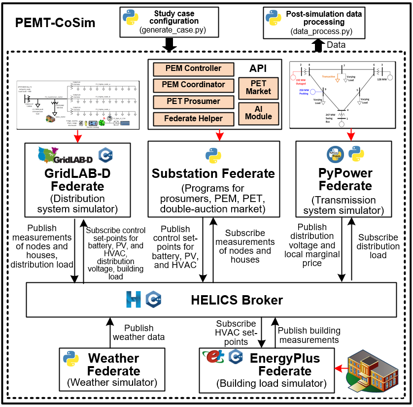
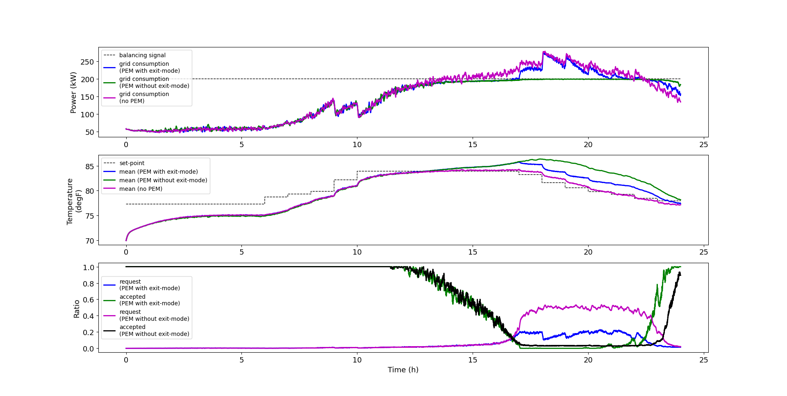
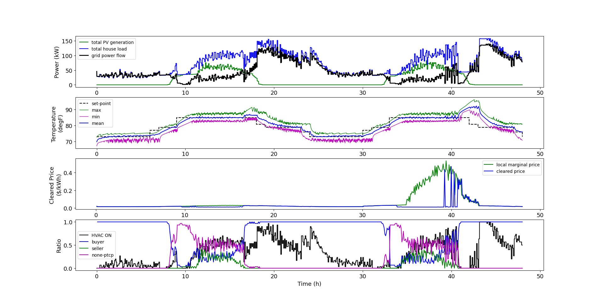
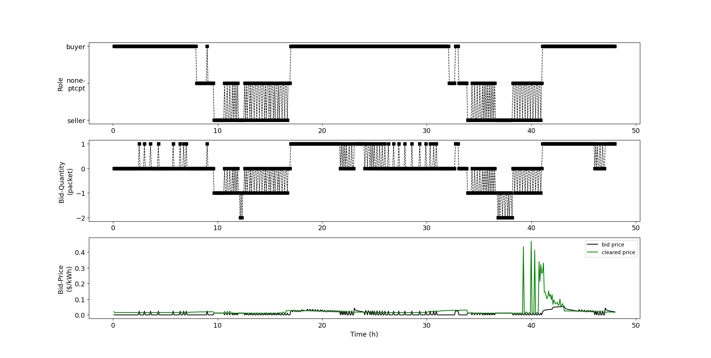

# PEMT-CoSim

A Co-Simulation Platform For Packetized Energy Management and Trading

## 1. Description
PEMT-CoSim is a co-simulation platform for packetized energy management (PEM) and trading (PET) in smart grids. It is developed based on the open-source [Transactive Energy Simulation Platform (TESP, v1.0.0)](https://tesp.readthedocs.io/en/latest/TESP_Overview.html#). 


Packetized Energy (PE) is a gird management technology which breaks the power into fixed-duration/fixed power "energy packet" with a "request-reply" scheme. Prosumers (both suppler and consumer) can request a packet for their load/generator to consume/provide. A central coordinator will accept/reject the request based on grid condition. There are two types of PE, Packetized Energy Management (PEM) and Packetized Energy Trading (PET). Packetized Energy Management (PEM) is a load dispatch program which uses a PEM controller to have houses' flexible load to request a packet with a probability, and the central coordinator will accept/reject the request by comparing the the request load with a balancing signal. PET allows prosumers to bid for a packet in a double-auction market. The cleared price and quantity determine whether bids are accepted or rejected for prosumers. 

PEMT-CoSim utilizes the TESP's HELICS co-simulation framework to enable coordination between a number of dedicated simulators/programs (named "federate" under the HECLIS framework): GridLAB-D federate (distribution system simulator),  PyPower federate (transmission system simulator), EnergyPlus federate(building simulator), Wether federate (weather data generator), Substation federate (Implemented the processes for PET and PEM). 


<center>PEMT-CoSim Architecture</center>

Substation is main federate which implements the PEM and PET using developed API, including PEM-related modules (PEM Controllers, PEM Coordinator), PET-related modules (PET Prosumer, PEM Market). Moreover, the AI modules implemented the reinforcement learning algorithm that can be used to optimize the biding strategies for prosumers.


## 2. Installation
PEMT-CoSim runs natively on Linux. However, for better deployment of this project,  it is suggested to run this project in a docker container. Therefore, PEMT-CoSim can also run in Windows and MacOS via docker. 

### 2.1 Installation via Docker 
Before the installation, the [Docker or Docker Desktop](https://www.docker.com/products/docker-desktop), and [Git](https://git-scm.com/) should be installed. 

- Clone the PEMT-CoSim Project from Github (https://github.com/Yuanliang-Li/PEMT-CoSim)
    > git clone https://github.com/Yuanliang-Li/PEMT-CoSim.git
    >
- Open a command prompt in Linux/Windows/MacOS, and cd into the "docker" directory of the PEMT-CoSim project.
    > cd docker
    >
- Build docker image
    > docker build . -t ubuntu-vnc
    >
- Build ubuntu docker container
    > docker run -it --privileged -p 2222:22 -p 5951:5901 --mount type=bind,source= /YOURDIRECTORY/To/PEMT-CoSim,destination=/PEMT-CoSim --name ubuntu-pemt ubuntu-vnc
    >
    When the 'docker run' command runs, the container starts and executes a startup .sh script that will set up the environment for development. \
    The "--mount" option can make a file or directory on the host machine mounted into the container. So, after the installation you can make development/edition/post-processing on your project in your host machine, and run the co-simulation in the container.
- Install TESP by typing when building the container
    > /root/startup/tesp-1.0.0-linux-x64-installer.run
    >
    After this step, you have now installed the PEMT-CoSim.

The following steps show how you start and connect to your running container
- Start the container (the container will run)
    > docker start ubuntu-pemt
- Connect to a running docker container
    > docker exec --privileged -it ubuntu-pemt /bin/bash


## 3. File Directory 
Denote "(c)" as configuration file, "(o)" as output file.
* _generate_case.py_ : a python script to generate a study case based on user configuration
* _glmhelper.py_ : a class including functions to generate the .glm file
* _plotFig.py_ : makes plots for the case
* fed_gridlabd : folder for Gridlab-D federate
   * (c) _TE_Challenge.glm_ : define the distribution power grid for Gridlab-D
   * (c) _outputs_te.glm_ : define the output record for Gridlab-D
   * (c) _phase_A.player_ : define the phase A voltage for the unresponsive load in Gridlab-D
   * (c) _phase_B.player_ : define the phase B voltage for the unresponsive load in Gridlab-D
   * (c) _phase_C.player_ : define the phase C voltage for the unresponsive load in Gridlab-D
   * (c) _TE_Challenge_glm_dict.json_ : a dictionary of elements in Gridlab-D
   * (c) _TE_Challenge_HELICS_gld_msg.json_ : define HELICS message flows for Gridlab-D federate
   * (o) _billing_meter_TE_ChallengeH_metrics.json_
   * (o) _house_TE_ChallengeH_metrics.json_
   * (o) _inverter_TE_ChallengeH_metrics.json_
   * (o) _line_TE_ChallengeH_metrics.json_
   * (o) _capacitor_TE_ChallengeH_metrics.json_
   * (o) _regulator_TE_ChallengeH_metrics.json_
   * (o) _eplus_load.csv_
   * (o) _evchargerdet_TE_ChallengeH_metrics.json_
   * (o) _substation_TE_ChallengeH_metrics.json_
   * (o) _weather.csv_
   * (o) _gridlabd.log_
* fed_pypower : folder for PyPower federate
   * _launch_pypower.py_ : python script for launching the PyPower federate
   * (c) _te30_pp.json_ : define the transmission system in PyPower 
   * (c) _NonGLDLoad.txt_ : define the nonresponsive load in transmission system
   * (c) _pypowerConfig.json_ : define HELICS message flows for PyPower federate
   * (o) _bus_TE_ChallengeH_metrics.json.csv_
   * (o) _gen_TE_ChallengeH_metrics.json_
   * (o) _pypower.log_
* fed_energyplus : folder for EnergyPlus federate and EnergyPlus agent federate
   * (c) _*.idf_ : define the building for the EnergyPlus
   * (c) _helics_eplus.json_ : define HELICS message flows for EnergyPlus federate
   * (c) _helics_eplus_agent.json_ : define HELICS message flows for EnergyPlus agent federate
   * (o) _eplus_TE_ChallengeH_metrics.json_
   * (o) _output_
   * (o) _eplus.log_
   * (o) _eplus_agent.log_
* fed_substation : folder for substation federate
   * _launch_substation.py_ : python script for launching the substation federate. Moreover, in this example, it is also the main federate that can launch other federates at the same time.
   * _federate_helper.py_ : some functions for managing the federate, managing co-simulation, and data recording
   * _my_auction.py_ : user-defined auction class for emulating the market
   * _PEM_Controller.py_ : define classes for PEM controller. 
   * _PEM_Coordinator.py_ : define classes for PEM coordinator. 
   * (c) _TE_Challenge_agent_dict.json_ : define the market agent and HVAC controller agents
   * (c) _TE_Challenge_HELICS_substation.json_ : define HELICS message flows for substation federate
   * (o) _data_: a folder that save all data for post-processing
* fed_weather : folder for weather federate
   * _launch_weather.py_ : python script for launching the weather federate
   * (c) _weather.dat_ : weather data for one specific place in one specific time period
   * (c) _TE_Challenge_HELICS_Weather_Config.json_ : weather federate configuration file
   * (o) _weather.log_

* my_tesp_support_api: include the modified version of TESP support API


## 4. Run Cases
### Run PEM example via prompt
In the docker container, type:
```
cd /PEMT-CoSim/demo-PEM
python3 generate_case.py 
cd ./fed_substation/
python3 launch_substation.py
```
To visualize the experimental results after the simulation
```
cd /PEMT-CoSim/
python3 plotFig.py
```

<center>PEM results</center>


### Run PET example via prompt
In the docker container, type:
```
cd /PEMT-CoSim/demo-PET
python3 generate_case.py 
cd ./fed_substation/
python3 launch_substation.py
```
To visualize the experimental results after the simulation
```
cd /PEMT-CoSim/
python3 plotFig.py
```


<center>PET results</center>

