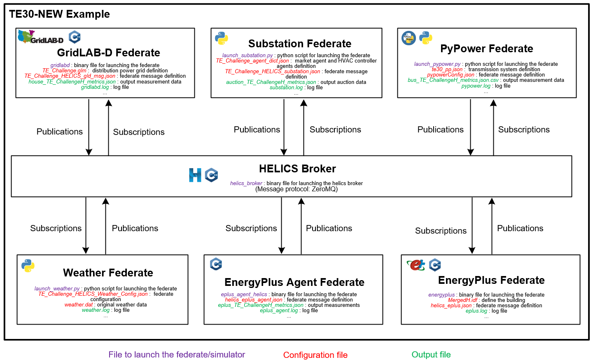
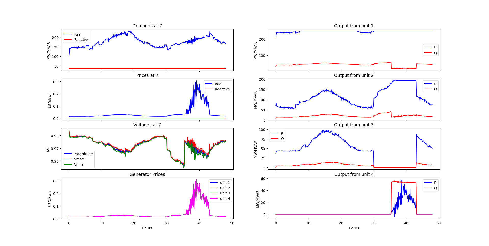
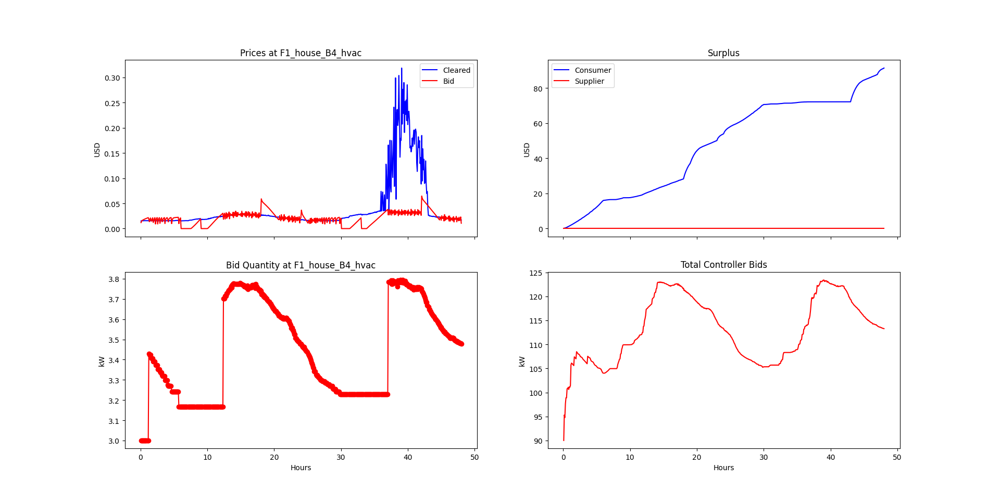
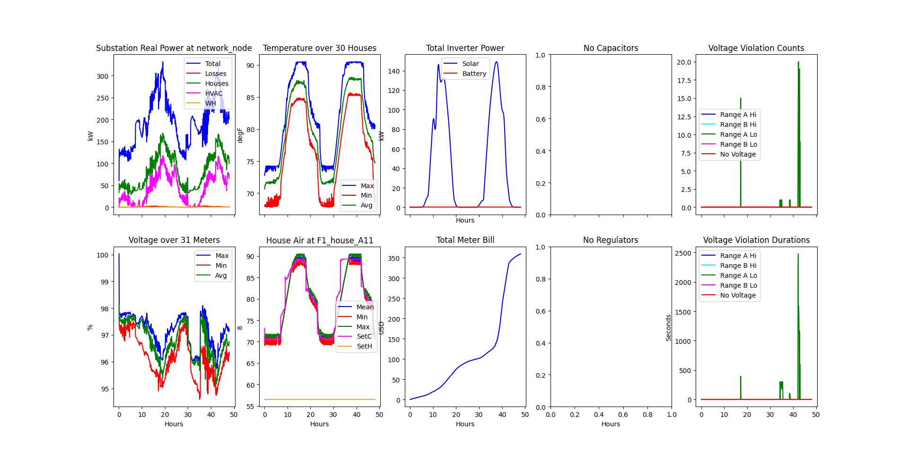
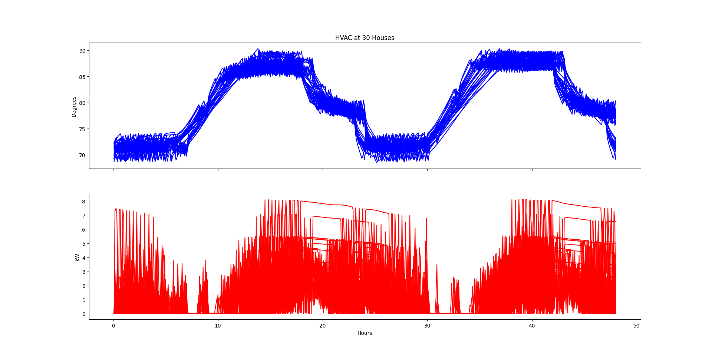
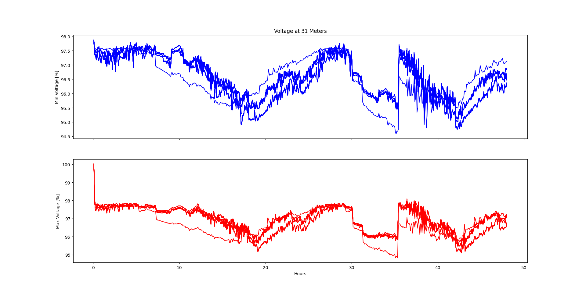
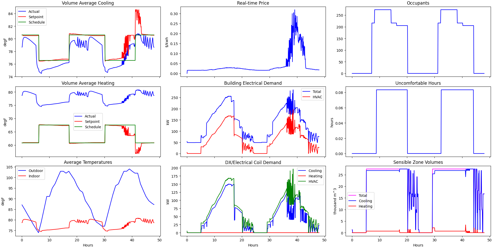

# TE30-NEW Example

This is a modified version of TE30 example based on modified TESP support API. In this example, federates are co-simulated over [HELICS](https://docs.helics.org/en/latest/index.html) instead of FNCS. This is because FNCS will be removed from the next version of TESP. So, it is better to choose HELICS as the synchronizer for the co-simulation in the long term. 

In this example, each federate has its folder saving its running programs, configuration files as well as its output files. Configuration files are files to set up the federate. They are generated before launching the simulation. Output files are files generated by this federate during or at the end of the simulation. 

In this example, official python-based TESP support API is copied and modified for the development purpose. For example, user can define their own market and demand response modules. 

## Co-simulation Framework
The co-simulation framework of TE30-NEW is shown as follow:

We have 6 federates co-simulated and time-synchronized by the central HELICS broker. The descriptions of each federate and the HELICS broker are listed as follow:
* **HELICS broker**: a special executable responsible for performing the two key tasks of the co-simulation: (1) maintaining time synchronization for all federates and (2) facilitating message exchange.
* **GridALB-D federate**: simulator for electric power distribution system, including the simulations of distributed energy resources, a variety of load, houses, etc.
* **PyPower federate**: simulate electric transmission system and perform power flow and optimal power flow calculation.
* **Substation federate**: a very important federate that simulates the market, demand response process (calculate setpoints for HVAC controllers for houses). It can also integrate other grid control functions for distribution system, e.g., inverter control, energy management, etc.
* **EnergyPlus federate**: simulator for large building, which plays as a load in the distribution system.
* **EnergyPlus Agent federate**: Since the EnergyPlus federate cannot directly publish power consumption specifically for the GridLAB-D to update its power flow, an agent is applied to translate related message. Moreover, the agent also performs demand response to calculate the HVAC setpoints based on the clear price from the market for the building. 

The message flows between federate and the HECLIS broker are described by publications and subscriptions. All federates publish their state parameters to the HELICS broker, and subscribe the data they want from the HELICS broker to update their state to the next simulation time step. So, the co-simulate can realize the data exchange between federates and be time-synchronized at the mean while. 


## File Directory 
Denote "(c)" as configuration file, "(o)" as output file.
* _prepare_case.py_ : python script to generate configuration files for all federates
* _run.py_ : python script for running the co-simulation case
* _plots.py_ : makes plots for the case
* _kill_clean.sh_ : first kill processes, then clean the working space including all output files, logs, and some configuration files.
* fed_gridlabd : folder for Gridlab-D federate
   * (c) _TE_Challenge.glm_ : define the distribution power grid for Gridlab-D
   * (c) _outputs_te.glm_ : define the output record for Gridlab-D
   * (c) _phase_A.player_ : define the phase A voltage for the unresponsive load in Gridlab-D
   * (c) _phase_B.player_ : define the phase B voltage for the unresponsive load in Gridlab-D
   * (c) _phase_C.player_ : define the phase C voltage for the unresponsive load in Gridlab-D
   * (c) _TE_Challenge_glm_dict.json_ : a dictionary of elements in Gridlab-D
   * (c) _TE_Challenge_HELICS_gld_msg.json_ : define HELICS message flows for Gridlab-D federate
   * (o) _billing_meter_TE_ChallengeH_metrics.json_
   * (o) _house_TE_ChallengeH_metrics.json_
   * (o) _inverter_TE_ChallengeH_metrics.json_
   * (o) _line_TE_ChallengeH_metrics.json_
   * (o) _capacitor_TE_ChallengeH_metrics.json_
   * (o) _regulator_TE_ChallengeH_metrics.json_
   * (o) _eplus_load.csv_
   * (o) _evchargerdet_TE_ChallengeH_metrics.json_
   * (o) _substation_TE_ChallengeH_metrics.json_
   * (o) _weather.csv_
   * (o) _gridlabd.log_
* fed_pypower : folder for PyPower federate
   * _launch_pypower.py_ : python script for launching the PyPower federate
   * (c) _te30_pp.json_ : define the transmission system in PyPower 
   * (c) _NonGLDLoad.txt_ : define the nonresponsive load in transmission system
   * (c) _pypowerConfig.json_ : define HELICS message flows for PyPower federate
   * (o) _bus_TE_ChallengeH_metrics.json.csv_
   * (o) _gen_TE_ChallengeH_metrics.json_
   * (o) _pypower.log_
* fed_energyplus : folder for EnergyPlus federate and EnergyPlus agent federate
   * (c) _*.idf_ : define the building for the EnergyPlus
   * (c) _helics_eplus.json_ : define HELICS message flows for EnergyPlus federate
   * (c) _helics_eplus_agent.json_ : define HELICS message flows for EnergyPlus agent federate
   * (o) _eplus_TE_ChallengeH_metrics.json_
   * (o) _output_
   * (o) _eplus.log_
   * (o) _eplus_agent.log_
* fed_substation : folder for substation federate
   * _launch_substation.py_ : python script for launching the substation federate
   * _my_auction.py_ : user-defined auction class for emulating the market
   * _my_hvac.py_ : user-defined hvac class for emulating the demand response
   * (c) _TE_Challenge_agent_dict.json_ : define the market agent and HVAC controller agents
   * (c) _TE_Challenge_HELICS_substation.json_ : define HELICS message flows for substation federate
   * (o) _auction_TE_ChallengeH_metrics.json_
   * (o) _controller_TE_ChallengeH_metrics.json_
   * (o) _substation.log_
* fed_weather : folder for weather federate
   * _launch_weather.py_ : python script for launching the weather federate
   * (c) _weather.dat_ : weather data for one specific place in one specific time period
   * (c) _TE_Challenge_HELICS_Weather_Config.json_ : weather federate configuration file
   * (o) _weather.log_

* my_tesp_support_api: include the modified version of TESP support API


## To run TE30-NEW
```
cd /pacblo/te30-new
./kill_clean.sh 
python3 prepare_case.py 
python3 run.py
```
Note: it is important to run kill_clean.sh and prepare_case.py before launching the simulation.

It will take serval minutes to complete the simulation.

## To plot results
```
python3 plots.py
```

## Results








# To apply user-defined market and demand response
Modify my_auction.py or my_hvac.py in fed_substation folder.

